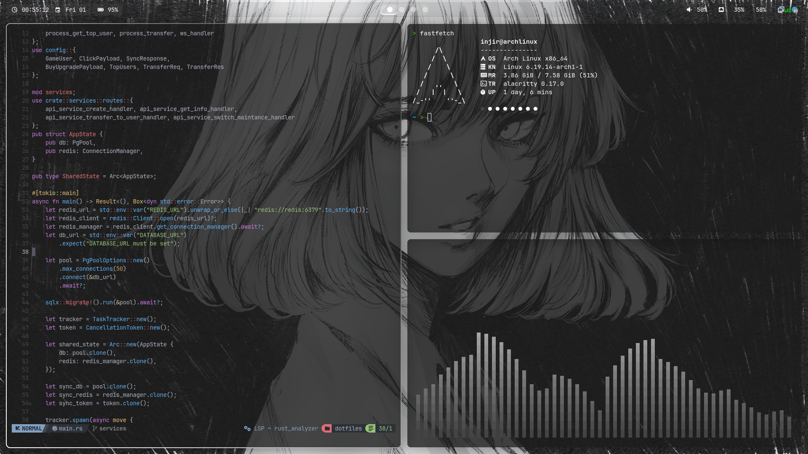

# 🌌 Niri Dotfiles: Neon Dark Setup


Welcome to my personal configuration for the **Niri** scroll-style tiling compositor. This setup is optimized for engineering workflows (Rust, Web Dev) and features a consistent **dark theme with vibrant neon accents**.

---

## 🖼️ Preview



*Desktop environment with Waybar, Alacritty, and Neovim.*

---

## 🛠️ Components

- **Compositor:** [Niri](https://github.com/YaLTeR/niri) (Dynamic scrolling tiling)
- **Status Bar:** [Waybar](https://github.com/Alexays/Waybar) (Custom neon-themed modules)
- **Terminal:** [Alacritty](https://github.com/alacritty/alacritty) (GPU-accelerated)
- **Editor:** [Neovim](https://github.com/neovim/neovim) (Lua-based, optimized for Rust & TS)
- **Shell:** [Zsh](https://www.zsh.org/) (with autosuggestions & syntax highlighting)
- **Visualizer:** [Cava](https://github.com/karlstav/cava) (Audio visualizer)
- **Fetch:** [Fastfetch](https://github.com/fastfetch-cli/fastfetch) (System info)

---

## 🚀 Installation

### ⚠️ Warning

Running the installation script will **overwrite** your existing configurations in `~/.config/`. It is highly recommended to back up your data before proceeding.

### Steps

1. **Clone the repository:**
   ```bash
   git clone https://github.com/KUMKBUT/niri-dotfiles.git
   cd niri-dotfiles
   ```

2. **Make the script executable:**
   ```bash
   chmod +x install.sh
   ```

3. **Run the installer:**
   ```bash
   ./install.sh
   ```

---

## ⌨️ Key Bindings (Vim-Style)

This setup relies heavily on Vim-like navigation to minimize mouse usage:

| Shortcut | Action |
|---|---|
| `Mod + Enter` | Open Alacritty Terminal |
| `Mod + Q` | Close Active Window |
| `Mod + H/J/K/L` | Navigate windows (Vim-style) |
| `Mod + Shift + R` | Reload Niri Configuration |
| `Mod + D` | Application Launcher |

---

## 📁 Repository Structure

```
.
├── config/           # App configurations (niri, nvim, waybar, etc.)
├── zsh/              # Zsh shell profile and .zshrc
├── sddm/             # Custom SDDM login screen settings
├── wallpapers/       # Neon-themed backgrounds and screenshots
└── install.sh        # Universal installation script
```

---

## 👨‍💻 Developed By

**KUMKBUT** (aka injir)

- Focus: Rust, Full-stack, Telegram Bots
- OS: Arch Linux

If you like this setup, don't forget to star the repository!
